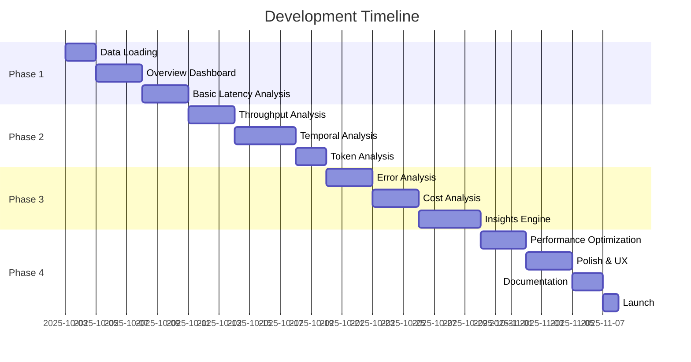

# Product Requirements Document: LLM Benchmark Comparison Dashboard

**Version:** 1.0  
**Status:** Draft  
**Last Updated:** October 3, 2025  
**Owner:** Product & Engineering  

---

## Executive Summary

Build a **production-grade Streamlit dashboard** for visualizing, comparing, and analyzing LLM inference benchmark results across multiple serving platforms (vLLM, TGI, Ollama, OpenAI, etc.). The dashboard enables platform engineers, ML engineers, and SREs to make data-driven choices about LLM serving infrastructure by providing deep, interactive analysis of performance characteristics.

**Core Value Proposition:** Transform raw CSV benchmark data into actionable intelligence through intuitive visualizations, statistical analysis, and automated insights.

**Design Approach:** Single professional technical view with visual metric cards for clarity. No dual-mode complexity.

---

## 1. Problem Statement

### 1.1 User Pain Points

**Current State:**
- Engineers run benchmarks using llm-locust, generating CSV files
- Analysis requires manual pandas/matplotlib scripting
- Comparing platforms is time-consuming and error-prone
- No standardized way to share results with stakeholders
- Insights are buried in spreadsheets or ad-hoc notebooks
- **Technical complexity creates barriers**: Metrics like TTFT, TPOT, P99 are intimidating to non-experts

**Impact:**
- Infrastructure decisions based on incomplete analysis
- Wasted time on repetitive analysis tasks
- Difficulty communicating performance trade-offs to non-technical stakeholders
- Missed optimization opportunities due to lack of visibility
- **Exclusion of key decision-makers** who don't understand the technical details

### 1.2 Target Users

**🎯 Primary Goal: "Professional tool for technical teams"**

#### Primary Persona: "The Technical Expert"
**Who:** Platform Engineers, ML Engineers, SREs, Performance Specialists

**Needs:**
- **Clear visual comparison**: Color-coded metric cards for at-a-glance understanding
- **Deep analysis**: Statistical significance, distributions, outliers
- **Multi-platform timelines**: See stability and degradation patterns
- **Technical precision**: Exact percentiles, p-values, effect sizes
- **Raw data access**: Export capabilities and detailed tables
- **Debug capability**: Find anomalies, investigate failures

**Pain Points:**
- Need to compare multiple platforms quickly
- Want statistical rigor without manual calculation
- Need to detect performance degradation over time
- Must justify infrastructure decisions with data

**Quote:** *"Show me the P99, prove it's statistically significant, and let me see if performance degrades over time."*

#### Secondary Persona: "The Manager"
**Who:** Engineering Managers, Technical Leads

**Needs:**
- **Quick executive summary**: Who won and why
- **Visual clarity**: Metric cards with color coding
- **Clear recommendations**: Data-driven infrastructure choices
- **Cost implications**: TCO analysis for budgeting

**Pain Points:**
- Need to make decisions quickly
- Want confidence in recommendations
- Must balance performance vs cost
- Need to communicate decisions to leadership

**Quote:** *"Give me the winner, show me why with clear visuals, and tell me what it costs."*

### 1.3 Design Philosophy: "Professional Simplicity"

**Inspired by:** FAANG engineering dashboards + Clear visual hierarchy

**Core Principles:**

1. **Visual First, Technical Second**
   - Color-coded metric cards for instant understanding
   - Green = excellent, Yellow = good, Red = needs attention
   - Winner badges (🏆) for immediate identification
   - Then provide deep technical details below

2. **Technical Rigor Without Complexity**
   - Statistical tests integrated naturally
   - P-values and effect sizes shown in context
   - Tooltips for explanations (not separate "Simple mode")
   - Professional tone throughout

3. **Single Source of Truth**
   - No duplicate information
   - Each metric shown once, in the right place
   - Clear navigation: Comparison → Deep Dives

4. **Information Density = User Control**
   - Key metrics always visible
   - Expandable sections for details
   - Tables for comprehensive data
   - Charts for patterns and trends

5. **Beautiful AND Functional**
   - Clean, professional interface
   - Publication-ready charts
   - Consistent visual language
   - Fast, responsive interactions

---

## 2. Goals & Success Metrics

### 2.1 Product Goals

**North Star:** Enable confident, data-driven LLM infrastructure decisions in **<15 minutes** from benchmark completion.

**Primary Goals:**
1. **Reduce analysis time** from hours to minutes
2. **Increase analysis depth** through automated insights
3. **Enable self-service** analysis for all stakeholders
4. **Standardize** performance reporting across teams

### 2.2 Success Metrics

**Efficiency Metrics:**
- Time to first insight: **<2 minutes** after loading data
- Comparison completion: **<5 minutes** for 2-5 platforms
- Analysis session duration: **10-15 minutes** average

**Quality Metrics:**
- User satisfaction: **>8/10** (NPS-style survey)
- Insight accuracy: **100%** statistical correctness
- Adoption rate: **>80%** of platform engineers

**Business Impact:**
- Infrastructure decision confidence: **+40%** increase
- Benchmark-driven optimizations: **>50%** of infrastructure changes
- Cost optimization opportunities identified: **≥3 per quarter**

---

## 3. User Stories & Scenarios

### 3.1 Core User Stories

**Epic 1: Data Loading & Validation**
```
As a Platform Engineer,
I want to upload multiple CSV benchmark files at once,
So that I can quickly compare different platforms without manual file management.

Acceptance Criteria:
- Support drag-and-drop or file picker
- Handle 1-20 CSV files simultaneously
- Auto-detect platform from filename
- Validate CSV schema and show clear errors
- Preview loaded data (first 100 rows)
```

**Epic 2: Platform Comparison**
```
As an ML Engineer,
I want to see side-by-side latency distributions for vLLM vs TGI,
So that I can choose the platform with better p99 latency for my use case.

Acceptance Criteria:
- Select 2-5 platforms for comparison
- Show TTFT and TPOT distributions on same chart
- Highlight statistical differences
- Display percentile tables (P50, P90, P99, P99.9)
- Export comparison report
```

**Epic 3: Temporal Analysis**
```
As a Platform Engineer,
I want to see how latency changes over the benchmark duration,
So that I can detect performance degradation or warm-up effects.

Acceptance Criteria:
- Time-series charts for key metrics
- Sliding window aggregation (configurable)
- Highlight degradation trends
- Annotate warm-up periods
- Compare stability across platforms
```

**Epic 4: Cost Analysis**
```
As an Engineering Manager,
I want to see cost per 1M tokens for each platform,
So that I can make budget-informed infrastructure decisions.

Acceptance Criteria:
- Input cost parameters (compute, GPU, etc.)
- Calculate throughput efficiency
- Show cost/performance trade-offs
- Project monthly costs at different scales
- Compare TCO across platforms
```

### 3.2 User Scenarios

**Scenario A: New Platform Evaluation**
> *Sarah, a Platform Engineer, needs to evaluate if vLLM is worth migrating to from TGI.*

**Workflow:**
1. Upload TGI baseline benchmark CSV
2. Upload vLLM candidate benchmark CSV
3. Review automated comparison summary
4. Drill into P99 latency differences
5. Check throughput at target concurrency
6. Export decision report for team review
7. **Decision Made:** 12 minutes, high confidence

**Scenario B: Performance Regression Investigation**
> *Mike, an SRE, notices production latency increased after a deployment.*

**Workflow:**
1. Upload pre-deployment and post-deployment benchmarks
2. View temporal latency charts
3. Identify warm-up period differences
4. Check for throughput degradation
5. Spot outlier requests
6. **Root Cause Identified:** 8 minutes

**Scenario C: Capacity Planning**
> *Jennifer, an Engineering Manager, needs to plan Q2 GPU procurement.*

**Workflow:**
1. Load current production benchmark
2. Input projected 3x traffic growth
3. Review throughput analysis
4. Compare cost efficiency across GPU types
5. Model different concurrency scenarios
6. Export capacity plan
7. **Budget Proposal Created:** 20 minutes

---

## 4. Functional Requirements

### 4.1 Data Management

#### FR-1: File Upload & Import
- **FR-1.1** Support CSV file upload (drag-drop + file picker)
- **FR-1.2** Handle 1-20 files simultaneously, max 500MB each
- **FR-1.3** Auto-detect platform from filename pattern: `{engine}-{datetime}-{benchmark-id}.csv`
- **FR-1.4** Validate CSV schema against expected columns
- **FR-1.5** Show upload progress and validation status
- **FR-1.6** Support clearing and re-uploading

#### FR-2: Data Validation & Quality
- **FR-2.1** Validate required columns exist
- **FR-2.2** Check for data type correctness (numeric fields)
- **FR-2.3** Detect and report missing values
- **FR-2.4** Identify outliers (>3 std dev) and flag
- **FR-2.5** Show data quality score per file
- **FR-2.6** Allow filtering out invalid rows

#### FR-3: Dataset Metadata
- **FR-3.1** Extract and display: platform, date, benchmark type, duration
- **FR-3.2** Show request counts, concurrency level
- **FR-3.3** Display token range (min/max input/output)
- **FR-3.4** Calculate and show benchmark coverage metrics

### 4.2 Visualization & Analytics

#### FR-4: Professional Dashboard
- **FR-4.1** **Visual Metric Cards**: Color-coded cards (green/yellow/red) for instant understanding
- **FR-4.2** **Winner Detection**: Automatic identification with 🏆 badges
- **FR-4.3** **Executive Summary**: Key findings and recommendation on home page
- **FR-4.4** **Comparison View**: Side-by-side visual comparison with all metric cards
- **FR-4.5** **Detailed Tables**: Comprehensive data tables for deep analysis
  
#### FR-4.5: Contextual Help System
- **FR-4.5.1** Inline tooltips for technical terms
- **FR-4.5.2** Expandable sections with explanations
- **FR-4.5.3** Chart captions explaining what to look for
- **FR-4.5.4** Help expanders with detailed metrics info

#### FR-5: Latency Analysis
- **FR-5.1** **TTFT Distribution**: Histogram + KDE for each platform
- **FR-5.2** **TPOT Distribution**: Histogram + KDE for each platform
- **FR-5.3** **Percentile Comparison**: Table with P50, P90, P95, P99, P99.9
- **FR-5.4** **Box Plots**: Side-by-side latency distributions
- **FR-5.5** **Violin Plots**: Show distribution shape and density
- **FR-5.6** **CDF Plots**: Cumulative distribution for tail analysis
- **FR-5.7** **Statistical Tests**: T-test, Wilcoxon for significance
- **FR-5.8** Highlight statistical differences (p < 0.05)

#### FR-6: Throughput Analysis
- **FR-6.1** **Tokens/Second Over Time**: Line chart per platform
- **FR-6.2** **Requests/Second**: Sustained vs peak RPS
- **FR-6.3** **Throughput Distribution**: Histogram of per-request throughput
- **FR-6.4** **Efficiency Score**: Tokens/sec per GPU (if GPU info provided)
- **FR-6.5** **Stability Analysis**: Coefficient of variation

#### FR-7: Temporal Analysis
- **FR-7.1** **Latency Over Time**: Scatter + rolling mean (configurable window)
- **FR-7.2** **Degradation Detection**: Auto-identify performance drops
- **FR-7.3** **Warm-up Analysis**: First N requests vs steady state
- **FR-7.4** **Per-User Analysis**: Request patterns by user_id
- **FR-7.5** **Time Bucketing**: Aggregate by minute/5min/10min
- **FR-7.6** **Heatmap**: Latency by time bucket and concurrency

#### FR-8: Token Analysis
- **FR-8.1** **Token Distribution**: Input vs output token scatter plot
- **FR-8.2** **Token Efficiency**: Latency vs token count correlation
- **FR-8.3** **Outlier Detection**: Identify anomalous token/latency combinations
- **FR-8.4** **Prompt Length Impact**: TTFT vs input tokens
- **FR-8.5** **Generation Length Impact**: TPOT vs output tokens

#### FR-9: Error & Reliability Analysis
- **FR-9.1** **Success Rate**: % of HTTP 200 responses
- **FR-9.2** **Error Distribution**: Breakdown by status code
- **FR-9.3** **Error Rate Over Time**: Timeline of failures
- **FR-9.4** **Error Correlation**: Errors vs concurrency/token count
- **FR-9.5** **Timeout Analysis**: Requests exceeding thresholds

#### FR-10: Cost Analysis Calculator
- **FR-10.1** Input form:
  - GPU Type (dropdown: H100, A100, L40S, V100, etc.)
  - Cloud Provider (dropdown: AWS, GCP, Azure, On-prem)
  - Instance Type (text input)
  - Cost per hour (auto-filled from common prices, editable)
- **FR-10.2** Calculate: Cost per 1M tokens (based on throughput)
- **FR-10.3** Calculate: Cost per 1K requests
- **FR-10.4** Calculate: Monthly cost projection at different QPS levels
- **FR-10.5** Show: Simple comparison table across platforms
- **FR-10.6** Show: Break-even analysis and cost savings

### 4.3 Comparison & Insights

#### FR-11: Side-by-Side Comparison
- **FR-11.1** Select 2-5 platforms for direct comparison
- **FR-11.2** Synchronized charts (same scales, axes)
- **FR-11.3** Difference highlighting (absolute + percentage)
- **FR-11.4** Winner badges for each metric
- **FR-11.5** Comparison summary table

#### FR-12: Statistical Analysis ✅ COMPLETE
- **FR-12.1** ✅ Statistical significance tests (Welch's t-test, Mann-Whitney U)
- **FR-12.2** ✅ Effect size calculation (Cohen's d)
- **FR-12.3** ✅ Automatic test selection based on data distribution (Shapiro-Wilk)
- **FR-12.4** ✅ P-value calculation and interpretation
- **FR-12.5** ✅ Confidence intervals (95%) on metrics

#### FR-13: Automated Insights
- **FR-13.1** Best performer detection (by metric)
- **FR-13.2** Degradation warnings (>10% slowdown over time)
- **FR-13.3** Outlier flagging (anomalous requests)
- **FR-13.4** Trade-off recommendations (latency vs throughput)
- **FR-13.5** SLA compliance check (user-defined thresholds)

### 4.4 Export & Reporting

#### FR-14: Export Capabilities
- **FR-14.1** Export charts as PNG/SVG (high resolution)
- **FR-14.2** Export data as CSV (filtered/aggregated)
- **FR-14.3** Export summary report as PDF
- **FR-14.4** Export comparison matrix as Excel
- **FR-14.5** Copy-to-clipboard for charts and tables

#### FR-15: Report Generation
- **FR-15.1** Auto-generate executive summary
- **FR-15.2** Include top 5 insights
- **FR-15.3** Platform recommendation with justification
- **FR-15.4** Appendix with full statistics
- **FR-15.5** Shareable URL (if hosted)

---

### 5.2 Usability

**NFR-3: User Experience**
- **Zero configuration**: Works immediately after upload
- **Self-documenting**: Tooltips and help text throughout
- **Responsive**: Works on laptop screens (1280x800+)
- **Accessible**: WCAG 2.1 AA compliance where possible
- **Fast feedback**: Progress indicators for all operations

**NFR-4: Design Quality**
- **Professional**: Publication-ready charts
- **Consistent**: Unified color scheme and typography
- **Intuitive**: Common patterns (e.g., Plotly interactions)
- **Polished**: No visual bugs or jarring transitions

### 5.3 Reliability

**NFR-5: Error Handling**
- Graceful degradation for invalid files
- Clear error messages with remediation steps
- No crashes on malformed CSV data
- Auto-recovery from calculation errors

**NFR-6: Data Integrity**
- Correct statistical calculations (validated against scipy/numpy)
- No data loss during transformations
- Deterministic results (same input → same output)
- Version tracking for calculation methods

### 5.4 Maintainability

**NFR-7: Code Quality**
- Type annotations throughout (mypy strict)
- Modular architecture (page per feature)
- Documented functions and classes

**NFR-8: Extensibility**
- Pluggable chart types
- Easy to add new metrics
- Configurable via config file
- Support for custom themes

---

## 6. Technical Architecture

### 6.1 Technology Stack

**Core Framework:**
- **Streamlit** (latest stable): Primary UI framework
- **Python 3.11+**: Language runtime

**Data Processing:**
- **Pandas 2.0+**: DataFrame operations
- **NumPy**: Numerical calculations
- **SciPy**: Statistical tests

**Visualization:**
- **Plotly**: Interactive charts (primary)
- **Altair**: Declarative charts (secondary)
- **Matplotlib/Seaborn**: Static exports

**Utilities:**
- **Pyarrow**: Fast CSV reading
- **Pydantic**: Data validation
- **Rich**: CLI formatting (if needed)

### 6.2 Application Structure

```
streamlit_app/
├── app.py                      # Main entry point (executive summary)
├── config.py                   # Configuration and constants
├── requirements.txt            # Dependencies
├── README.md                   # Setup and usage guide
│
├── pages/                      # Streamlit multi-page app
│   ├── 1_Comparison.py         # ✅ Visual dashboard with metric cards
│   ├── 2_Latency_Analysis.py   # ✅ TTFT, TPOT, E2E deep dive
│   ├── 3_Throughput_Analysis.py # ✅ TPS, RPS, stability
│   ├── 4_Reliability.py        # ✅ Error analysis, success rates
│   ├── 5_Token_Analysis.py     # 🚧 Next: Input/output correlations
│   └── 6_Cost_Analysis.py      # 🚧 Next: TCO calculator
│
├── lib/                        # Business logic
│   ├── __init__.py
│   ├── data_loader.py          # ✅ CSV loading and validation
│   ├── statistics.py           # ✅ Statistical tests (t-test, Mann-Whitney, Cohen's d)
│   ├── visualizations.py       # ✅ Chart factory functions (Plotly)
│   ├── components.py           # ✅ Reusable UI components (metric cards)
│   ├── explanations.py         # ✅ Glossary and tooltips
│   └── dashboard.py            # ✅ Dashboard rendering logic
│
├── models/                     # Data models
│   ├── __init__.py
│   └── benchmark.py            # ✅ BenchmarkData, BenchmarkMetadata, ComparisonResult
│
├── docs/                       # Documentation
│   ├── PRD_BENCHMARK_DASHBOARD.md
│   ├── IMPLEMENTATION_STATUS.md
│   ├── REFACTORING_PLAN.md
│   └── SPRINT1_COMPLETION.md
│
└── tests/                      # Unit tests (future)
    └── __init__.py
```

### 6.3 Data Models

```python
from pydantic import BaseModel, Field
from typing import Literal

class BenchmarkMetadata(BaseModel):
    """Metadata extracted from benchmark CSV"""
    platform: str  # vllm, tgi, ollama, etc.
    benchmark_id: str  # 1a-chat-simulation
    timestamp: datetime
    total_requests: int
    duration_seconds: float
    concurrency: int
    
class BenchmarkData(BaseModel):
    """Complete benchmark dataset"""
    metadata: BenchmarkMetadata
    df: pd.DataFrame  # Raw data
    quality_score: float = Field(ge=0, le=100)
    
    # Cached calculations
    ttft_p50: float
    ttft_p90: float
    ttft_p99: float
    tpot_p50: float
    tpot_p90: float
    tpot_p99: float
    throughput_avg: float
    success_rate: float

class ComparisonResult(BaseModel):
    """Result of comparing two benchmarks"""
    platform_a: str
    platform_b: str
    winner: Literal["a", "b", "tie"]
    
    # Metrics
    ttft_diff_pct: float
    tpot_diff_pct: float
    throughput_diff_pct: float
    
    # Statistical significance
    ttft_significant: bool
    tpot_significant: bool
    p_value: float
```

### 6.4 Key Algorithms

#### Statistical Significance Testing
```python
def compare_latencies(
    benchmark_a: BenchmarkData,
    benchmark_b: BenchmarkData,
    alpha: float = 0.05
) -> ComparisonResult:
    """
    Compare latency distributions using appropriate statistical test.
    
    Algorithm:
    1. Check normality (Shapiro-Wilk test)
    2. If normal: Use Welch's t-test
    3. If non-normal: Use Mann-Whitney U test
    4. Calculate effect size (Cohen's d)
    5. Determine practical significance (>5% difference)
    6. Return comprehensive comparison
    """
```

#### Degradation Detection
```python
def detect_degradation(
    df: pd.DataFrame,
    metric: str,
    window_size: int = 100,
    threshold: float = 0.10
) -> list[DegradationEvent]:
    """
    Detect performance degradation over time.
    
    Algorithm:
    1. Calculate rolling mean with window_size
    2. Compute rolling std deviation
    3. Identify points where mean increases >threshold
    4. Check if increase is sustained (>3 consecutive windows)
    5. Flag as degradation event with severity
    """
```

#### Insight Generation
```python
def generate_insights(
    benchmarks: list[BenchmarkData],
    context: AnalysisContext
) -> list[Insight]:
    """
    Generate automated insights from benchmarks.
    
    Algorithm:
    1. Run statistical comparisons (pairwise)
    2. Check for SLA violations (user-defined thresholds)
    3. Detect degradation patterns
    4. Identify outliers (>3 std dev)
    5. Calculate cost efficiency
    6. Rank insights by importance
    7. Return top N actionable insights
    """
```

---

## 7. User Interface Design

### 7.1 Layout Principles

**Information Hierarchy:**
1. **Level 1:** Critical decisions (which platform is best?)
2. **Level 2:** Supporting evidence (percentile tables, charts)
3. **Level 3:** Deep analysis (statistical tests, raw data)

**Progressive Disclosure:**
- Start with high-level overview
- Expandable sections for details
- Tabs for different analysis types
- Modals for raw data exploration

**Responsive Design:**
- Primary: 1920x1080 (24" monitors)
- Secondary: 1280x800 (13" laptops)
- Use Streamlit columns for layout
- Scrollable sections for long content

### 7.2 Page Designs

#### 7.2.1 Current Implementation

**Home Page - Executive Summary:**
```
┌─────────────────────────────────────────────────┐
│  🎯 LLM Benchmark Dashboard                     │
│  Professional analysis tool for comparing       │
│  LLM serving platforms                          │
├─────────────────────────────────────────────────┤
│  📊 EXECUTIVE SUMMARY                           │
│                                                  │
│  Platforms: 3 | Total Requests: 30K            │
│  Avg Duration: 900s | Date: Oct 3, 2025        │
│                                                  │
│  🏆 RECOMMENDATION: vLLM                        │
│  • Fastest TTFT: 234ms (P50)                   │
│  • P99: 456ms                                   │
│  • Reliability: 99.8%                           │
│                                                  │
│  📊 KEY METRICS AT-A-GLANCE                    │
│  [3 columns with quick metrics per platform]   │
│                                                  │
└─────────────────────────────────────────────────┘
```

**Comparison Page - Visual Dashboard (CURRENT):**
```
┌─────────────────────────────────────────────────┐
│  📊 Platform Comparison Dashboard               │
│  Visual comparison of 3 platforms               │
├─────────────────────────────────────────────────┤
│  [3 columns side-by-side]                       │
│                                                  │
│  🏆 vLLM        │ TGI          │ Ollama          │
│  ─────────────────────────────────────────────  │
│                                                  │
│  [Green Card]   │ [Yellow Card] │ [Red Card]    │
│  ⚡ TTFT        │ ⚡ TTFT       │ ⚡ TTFT         │
│  195.48ms 🏆   │ 289ms        │ 312ms          │
│  P90: 229ms    │ P90: 356ms   │ P90: 398ms     │
│  P99: 310ms    │ P99: 578ms   │ P99: 623ms     │
│                                                  │
│  [Blue Card]    │ [Blue Card]  │ [Blue Card]    │
│  🔄 TPOT       │ 🔄 TPOT      │ 🔄 TPOT        │
│  0.00ms        │ 0.00ms       │ 0.00ms         │
│                                                  │
│  [Purple Card]  │ [Purple Card]│ [Purple Card]  │
│  🚀 TPS        │ 🚀 TPS       │ 🚀 TPS         │
│  0 tok/s       │ 0 tok/s      │ 512 tok/s 🏆  │
│  RPS: 89.73    │ RPS: ...     │ RPS: ...       │
│                                                  │
│  [Yellow Card]  │ [Yellow Card]│ [Yellow Card]  │
│  🔤 TOKEN STATS│ 🔤 TOKEN...  │ 🔤 TOKEN...    │
│  3835 → 0      │ 4265 → 0     │ 3548 → 512     │
│                                                  │
│  [Green Card]   │ [Yellow Card]│ [Red Card]     │
│  ✅ SUCCESS    │ ✅ SUCCESS   │ ✅ SUCCESS     │
│  34.64% 🏆     │ 99.73%       │ 98.9%          │
│  600 failures  │ 27 failures  │ 109 failures   │
│                                                  │
│  [Pink Card]    │ [Pink Card]  │ [Pink Card]    │
│  ⏱️ END-TO-END │ ⏱️ END...    │ ⏱️ END...      │
│  0.21s 🏆      │ 0.28s        │ 0.35s          │
│                                                  │
├─────────────────────────────────────────────────┤
│  🏆 = Best in category • Green = Excellent     │
│  Yellow = Good • Red = Needs attention          │
├─────────────────────────────────────────────────┤
│  📋 Detailed Comparison Table                   │
│  [Full metrics table with all platforms]        │
└─────────────────────────────────────────────────┘
```

#### 7.2.2 Latency Analysis Page

**Components:**
1. **Metric Selector:** TTFT | TPOT | End-to-End
2. **Platform Selector:** Multi-select for comparison
3. **Distribution Chart:** Histogram + KDE overlay
4. **Percentile Table:** P50/P90/P95/P99/P99.9
5. **Statistical Tests:** T-test results, p-values
6. **Box Plot:** Side-by-side comparison
7. **CDF Plot:** Cumulative distribution

**Interactions:**
- Hover: Show exact values
- Click: Filter to specific range
- Zoom: Pan and zoom on distributions
- Export: Download chart as PNG

#### 7.2.3 Temporal Analysis Page

**Components:**
1. **Time-Series Chart:** Latency over time (scatter + rolling mean)
2. **Degradation Detector:** Auto-highlight degradation periods
3. **Warm-up Analysis:** First N vs steady state comparison
4. **Heatmap:** Latency by time bucket
5. **Per-User View:** Request patterns by user_id

**Controls:**
- Window size slider (rolling mean)
- Time bucketing selector (1min/5min/10min)
- Warm-up period input (requests to exclude)

#### 7.2.4 Cost Analysis Page (Phase 2)

**Input Form (Per Platform):**
```
Select Platform: [vLLM ▼]

GPU Type: [H100 ▼]  (H100, A100, L40S, V100, etc.)
Cloud Provider: [AWS ▼]  (AWS, GCP, Azure, On-prem)
Instance Type: [p5.48xlarge]
Cost per Hour: [$30.00] (auto-filled, editable)

[Calculate →]
```

**Output - Comparison Table:**
```
┌─────────────────────────────────────────────────┐
│ 💰 Cost Efficiency Comparison                  │
│                                                  │
│ Platform│GPU  │Instance    │$/hr │Cost/1M│Monthly│
│─────────┼─────┼────────────┼─────┼───────┼───────│
│ vLLM    │H100 │p5.48xlarge │$30  │$0.45  │$21,600│
│ TGI     │H100 │p5.48xlarge │$30  │$0.52  │$21,600│
│ Ollama  │A100 │p4d.24xlarge│$25  │$0.61  │$18,000│
│                                                  │
│ 🎯 INSIGHTS                                     │
│ • vLLM: Most token-efficient (lowest $/1M tok) │
│ • Ollama: Cheaper hardware, but lower efficiency│
│ • At 100 QPS: vLLM processes 2.2M tokens/hr    │
│                                                  │
└─────────────────────────────────────────────────┘
```

### 7.3 Color Scheme

**Primary Palette:**
- **Success/Winner:** #10B981 (green)
- **Warning:** #F59E0B (amber)
- **Error:** #EF4444 (red)
- **Info:** #3B82F6 (blue)

**Platform Colors** (for charts):
- vLLM: #8B5CF6 (purple)
- TGI: #EC4899 (pink)
- Ollama: #06B6D4 (cyan)
- OpenAI: #10B981 (green)
- Custom: #F59E0B (amber)

**Background:**
- Light mode: #FFFFFF / #F9FAFB
- Dark mode: #1F2937 / #111827 (optional)

### 7.4 Typography

**Fonts:**
- **Headings:** System font stack (San Francisco, Segoe UI, etc.)
- **Body:** System font stack
- **Monospace:** JetBrains Mono (for metrics, code)

**Sizes:**
- H1: 32px
- H2: 24px
- H3: 20px
- Body: 16px
- Small: 14px

---

## 8. Implementation Plan

### 8.1 Phases

**Phase 1: Core Dashboard** ✅ COMPLETE
- ✅ Data loading and validation
- ✅ Visual comparison dashboard with metric cards
- ✅ Latency analysis (TTFT/TPOT distributions, box plots, CDF)
- ✅ Multi-platform timeline charts (stability & degradation)
- ✅ Statistical significance testing (t-test, Mann-Whitney, Cohen's d)
- ✅ Throughput analysis with stability metrics
- ✅ Error/Reliability analysis with pie charts and tabs
- ✅ Comprehensive comparison tables

**Phase 2: Enhanced Analytics (Current)** 🚧 In Progress
- 🚧 Token Analysis page (scatter plots, correlations)
- 🚧 Cost Analysis calculator (GPU type, cloud provider, TCO)
- 🚧 Export capabilities (PNG charts, PDF reports)
- 🚧 Enhanced automated insights

**Phase 3: Polish & Scale (Future)**
- Performance optimization (large files, caching)
- Advanced anomaly detection
- Custom SLA threshold configuration
- Degradation alerts and notifications
- Report scheduling and sharing

### 8.2 Development Roadmap



### 8.3 Phase 1 Acceptance Criteria ✅ COMPLETE

**Must Have:**
- ✅ Upload 2+ CSV files successfully
- ✅ Visual comparison dashboard with color-coded metric cards
- ✅ Show TTFT, TPOT, and TPS distributions
- ✅ Calculate P50/P90/P95/P99/P99.9 percentiles correctly
- ✅ Multi-platform timeline charts for all metrics
- ✅ Statistical significance testing (p-values, effect sizes)
- ✅ Box plots and CDF charts
- ✅ Error analysis with status code pie charts
- ✅ Zero crashes on valid input
- ✅ Clear error messages for invalid/incomplete data
- ✅ Winner detection with badges
- ✅ Stability and degradation analysis

**Phase 2 Goals:**
- 🚧 Token Analysis (scatter plots, correlations)
- 🚧 Cost Analysis calculator (GPU type, cloud provider)
- 🚧 Export charts as PNG/PDF
- 🚧 Enhanced automated insights

---

## 9. Dependencies & Integrations

### 9.1 External Dependencies

**Required:**
- llm-locust CSV output (existing format)
- Python 3.11+ runtime
- 4GB+ RAM for large datasets

**Optional:**
- Cost data API (AWS/GCP pricing)
- Git repo for version control
- CI/CD pipeline for deployment

### 9.2 Integration Points

**Input:**
- CSV files from llm-locust benchmarks
- Optional: JSON config for SLA thresholds
- Optional: Cost parameters via form or config file

**Output:**
- Interactive web dashboard
- PNG/SVG chart exports
- PDF reports
- CSV data exports
- Shareable URLs (if hosted)

